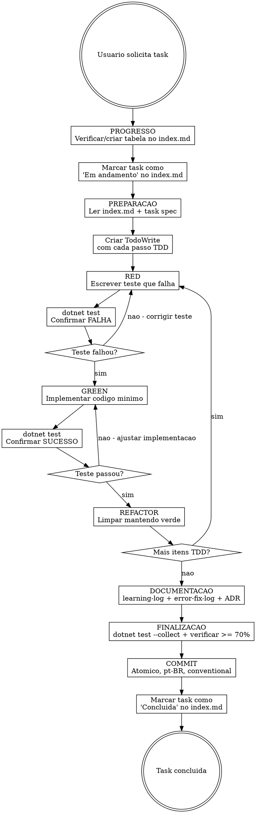

# Mnemosyne Task Workflow

## Visao Geral

Guia a execucao de uma task do roadmap do Mnemosyne. Cada task segue um ciclo rigido:
**Preparacao -> TDD (RED/GREEN/REFACTOR) -> Documentacao -> Finalizacao**.

Nao existe atalho. Pular etapas e uma violacao do processo.

## Quando Usar

- Usuario pede para executar uma task de uma fase (ex: "execute a task 06 da fase 2")
- Usuario pede para implementar algo que corresponde a um arquivo em `docs/plan/`
- Qualquer trabalho de implementacao no roadmap do Mnemosyne

## Quando NAO Usar

- Bugfixes ad-hoc que nao fazem parte de uma task planejada
- Exploracao ou pesquisa sem intencao de implementar
- Alteracoes puramente de documentacao

## Fluxo Principal



---

## Fase 1: Preparacao

### 1.0 Verificar/criar tabela de progresso no index.md

**Este e o PRIMEIRO passo, antes de qualquer outra coisa.**

Leia `docs/plan/fase{N}/index.md` e verifique se existe a secao `## Progresso` no final do arquivo.

**Se NAO existir:** crie a secao no final do `index.md` com todas as tasks listadas. Determine o status de cada task verificando se o codigo correspondente ja existe no codebase (arquivos criados, handlers implementados, testes presentes). Exemplo:

```markdown
## Progresso

| # | Task | Status |
|---|------|--------|
| 01 | Autenticacao por API Key | Concluida |
| 02 | CRUD de projetos | Concluida |
| 03 | Indexacao assincrona | Concluida |
| 04 | OpenAI Embedding Service | Concluida |
| 05 | Compressao de contexto | Concluida |
| 06 | gRPC Services | Pendente |
| 07 | Observabilidade | Pendente |
| 08 | Hardening | Pendente |
```

**Se JA existir:** leia a tabela para entender o estado atual. Use essa informacao para saber onde retomar.

**Status possiveis:**
- `Pendente` -- task nao iniciada
- `Em andamento` -- task sendo implementada agora
- `Concluida` -- task finalizada e commitada

Apos verificar/criar a tabela, **marque a task atual como `Em andamento`** no index.md.

### 1.1 Ler o index da fase

Leia `docs/plan/fase{N}/index.md` para entender:
- **Sequencia recomendada** de execucao
- **Dependencias** entre tasks
- **Paralelismo validado** -- quais tasks podem rodar juntas
- **Observacoes de execucao**

Se a task depende de outra que nao foi implementada, **PARE** e informe o usuario.

### 1.2 Ler a spec da task

Leia o arquivo da task: `docs/plan/fase{N}/{NN}-slug.md`

Extraia:
- **Objetivo** -- o que deve ser entregue
- **Dependencias** -- tasks prerequisito
- **Arquivos** -- criar, modificar, testar (listados na spec)
- **Planejamento TDD** -- os 7 passos definidos no arquivo

### 1.3 Criar TodoWrite

Crie um TodoWrite com cada item do planejamento TDD da spec. Cada passo RED/GREEN/REFACTOR vira um todo individual. Exemplo:

```
[ ] RED: Escrever teste para CreateMemoryHandler
[ ] Verificar falha: dotnet test --filter "ClassName~CreateMemoryHandlerTests"
[ ] GREEN: Implementar CreateMemoryHandler
[ ] Verificar sucesso: dotnet test --filter "ClassName~CreateMemoryHandlerTests"
[ ] REFACTOR: Limpar CreateMemoryHandler
[ ] Atualizar learning-log.md
[ ] Atualizar error-fix-log.md
[ ] Verificar cobertura >= 70%
[ ] Commit
```

---

## Fase 2: Ciclo TDD

### RED -- Escrever teste que falha

1. Crie o arquivo de teste seguindo convencoes do projeto:
   - Classe: `{ClassUnderTest}Tests`
   - Metodo: `{Condicao}_Executed_{Resultado}`
   - `[Fact(DisplayName = "descricao em pt-BR")]`
   - `[Trait("Layer", "Application - Commands")]` (ou Queries, Domain, Infrastructure)
   - AAA com comentarios `// Arrange`, `// Act`, `// Assert`
   - Moq para mocks, AutoFixture para dados

2. Execute o teste e **confirme que falha**:
   ```bash
   dotnet test --filter "ClassName~{ClasseDoTeste}"
   ```

3. Se o teste nao falha (compila e passa), algo esta errado. O teste nao esta testando nada novo. Reescreva.

**REQUIRED:** Carregue a skill `xunit-tests` para convencoes detalhadas de testes.

### GREEN -- Implementar codigo minimo

1. Implemente apenas o necessario para o teste passar
2. Siga as convencoes do AGENTS.md (file-scoped namespaces, nullable, records para DTOs, etc.)
3. Execute o teste e **confirme que passa**:
   ```bash
   dotnet test --filter "ClassName~{ClasseDoTeste}"
   ```

4. Se nao passa, corrija a implementacao. NAO corrija o teste (a menos que o teste tenha um bug real).

**REQUIRED:** Carregue a skill `dotnet-conventions` para padroes de codigo.

### REFACTOR -- Limpar mantendo testes verdes

1. Renomear, extrair metodos, simplificar -- melhore o codigo
2. Execute os testes novamente para garantir que ainda passam:
   ```bash
   dotnet test
   ```
3. Se algo quebrou, desfaca a refatoracao e tente de novo

### Repetir

Volte ao RED para o proximo item do TodoWrite. Repita ate todos os itens TDD estarem completos.

---

## Fase 3: Documentacao

A documentacao e um **deliverable obrigatorio**, nao uma cortesia.

### 3.1 Learning Log

Adicione entrada em `docs/implementation/learning-log.md`:

```markdown
### Fase {N} - Task {NN}: {titulo}

**Data:** YYYY-MM-DD

- {aprendizado 1}
- {aprendizado 2}
```

Registre: decisoes tecnicas, surpresas, APIs que se comportaram diferente do esperado, padroes que funcionaram bem.

### 3.2 Error Fix Log

Se encontrou problemas, adicione em `docs/implementation/error-fix-log.md`:

```markdown
### Fase {N} - Task {NN}: {titulo}

**Problema:** {descricao}
**Causa:** {causa raiz}
**Solucao:** {como resolveu}
```

### 3.3 ADR (se aplicavel)

Se tomou uma decisao arquitetural significativa, crie um ADR em `docs/implementation/adr/`:

- Proximo numero sequencial (ex: `004-slug.md`)
- Formato: Titulo, Status (Aceito), Contexto, Decisao, Consequencias
- Idioma: pt-BR

---

## Fase 4: Finalizacao

### 4.1 Verificar cobertura

```bash
dotnet test --collect:"XPlat Code Coverage"
```

A cobertura minima aceitavel e **70%** de line coverage. Se estiver abaixo, adicione mais testes antes de prosseguir.

### 4.2 Build completo

```bash
dotnet build
dotnet test
```

Ambos devem passar sem erros nem warnings relevantes.

**REQUIRED:** Carregue a skill `verification-before-completion` antes de declarar a task como concluida.

### 4.3 Commit

Formato obrigatorio (pt-BR, Conventional Commits):

```
<tipo>(<escopo>): <descricao>

<corpo opcional>
```

Tipos: `feat`, `fix`, `docs`, `test`, `chore`, `refactor`

Regras:
- Um commit por tarefa logica
- Nunca misturar codigo com documentacao no mesmo commit
- Nunca misturar features nao relacionadas

**REQUIRED:** Carregue a skill `commit-safety` antes de commitar.

### 4.4 Atualizar progresso no index.md

Apos o commit, abra `docs/plan/fase{N}/index.md` e altere o status da task de `Em andamento` para `Concluida` na tabela `## Progresso`.

Isso fecha o ciclo iniciado no passo 1.0. Se voce esqueceu de criar a tabela la, crie agora seguindo as instrucoes do 1.0 e marque esta task como `Concluida`.

**Importante:** Esta alteracao no index.md NAO precisa de commit separado -- inclua no mesmo commit de documentacao ou no proximo commit atomico logico.

---

## Referencia Rapida

### Caminhos

| Recurso | Caminho |
|---------|---------|
| Indice da fase | `docs/plan/fase{N}/index.md` |
| Spec da task | `docs/plan/fase{N}/{NN}-slug.md` |
| Learning log | `docs/implementation/learning-log.md` |
| Error fix log | `docs/implementation/error-fix-log.md` |
| ADRs | `docs/implementation/adr/{NNN}-slug.md` |
| Release notes | `docs/implementation/release-notes-v{N}.md` |

### Comandos

| Acao | Comando |
|------|---------|
| Build | `dotnet build` |
| Todos os testes | `dotnet test` |
| Testes unitarios | `dotnet test tests/Mnemosyne.UnitTests` |
| Testes de integracao | `dotnet test tests/Mnemosyne.IntegrationTests` |
| Teste por classe | `dotnet test --filter "ClassName~NomeDaClasse"` |
| Teste por nome | `dotnet test --filter "FullyQualifiedName~Classe.Metodo"` |
| Teste por trait | `dotnet test --filter "Layer=Application - Commands"` |
| Cobertura | `dotnet test --collect:"XPlat Code Coverage"` |
| Relatorio | `reportgenerator -reports:"tests/**/coverage.cobertura.xml" -targetdir:"coverage"` |
| Infra | `docker compose up -d` |

### Skills obrigatorias

| Momento | Skill |
|---------|-------|
| Antes de escrever testes | `xunit-tests` |
| Antes de escrever codigo | `dotnet-conventions` |
| Antes de commitar | `commit-safety` |
| Antes de declarar "pronto" | `verification-before-completion` |

### Status das fases

| Fase | Escopo | Status |
|------|--------|--------|
| 1 | Foundation (bootstrap, dominio, persistencia, search, e2e) | Completa |
| 2 | Auth, Projects, Indexacao, Embeddings, Compressao, gRPC, Observabilidade | Tasks 01-05 completas |
| 3 | CLI, SKILLs, Dashboard | Nao iniciada |
| 4 | Redis, Load Testing, Security, Deploy, Beta | Nao iniciada |
| 5 | Enterprise SSO, RBAC, FinOps, LGPD, Multi-regiao, Marketplace | Nao iniciada |

---

## Red Flags -- PARE e Reavalie

- **Implementou codigo antes de escrever teste** -- Delete o codigo. Escreva o teste primeiro.
- **Teste passou na primeira execucao** -- O teste nao testa nada novo. Reescreva.
- **Commit sem rodar `dotnet test`** -- Nunca. Execute sempre.
- **Pulou documentacao** -- Volte e atualize learning-log e error-fix-log.
- **"So vou commitar depois"** -- Nao. Documente e commite ao finalizar cada task.
- **"Essa task e simples, nao precisa de TDD"** -- Precisa. Todas precisam. Sem excecao.
- **Task depende de outra nao implementada** -- PARE. Informe o usuario. Nao improvise.

---

## Erros Comuns

| Erro | Correcao |
|------|----------|
| Implementar tudo de uma vez | Ciclo RED/GREEN/REFACTOR por item, nao por task inteira |
| Testes que nao falham no RED | O teste deve referenciar codigo que ainda nao existe |
| Esquecer `CancellationToken` | Todo metodo async recebe `CancellationToken` |
| Commit misturando codigo e docs | Commits atomicos: codigo separado de documentacao |
| Cobertura abaixo de 70% | Adicione testes antes de commitar |
| Pular leitura do index.md | Dependencias ignoradas causam retrabalho |
